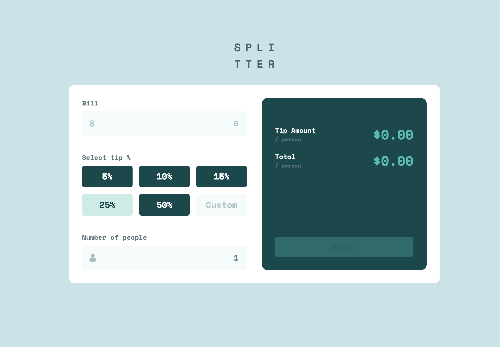

# Tip calculator app solution

This is a solution to the [Tip calculator app challenge on Frontend Mentor](https://www.frontendmentor.io/challenges/tip-calculator-app-ugJNGbJUX). Frontend Mentor challenges help you improve your coding skills by building realistic projects.

## Table of contents

- [Tip calculator app solution](#tip-calculator-app-solution)
  - [Table of contents](#table-of-contents)
  - [Overview](#overview)
    - [The challenge](#the-challenge)
    - [Screenshot](#screenshot)
    - [Links](#links)
  - [My process](#my-process)
    - [Built with](#built-with)
    - [What I learned](#what-i-learned)
  - [Author](#author)
  - [Acknowledgments](#acknowledgments)

## Overview

### The challenge

Users should be able to:

- View the optimal layout for the app depending on their device's screen size
- See hover states for all interactive elements on the page
- Calculate the correct tip and total cost of the bill per person

### Screenshot

### Links

- Live Site URL: [Tip Calculator](https://tip-calculator-sigma-ruddy.vercel.app/)

## My process

### Built with

- Semantic HTML5 markup
- SCSS
- Flexbox
- CSS Grid
- Mobile-first workflow
- JavaScript

### What I learned

I reviewed how to work with JavaScript functions and adding/removing classes. I wrote the code myself, but some functions weren't working, so I asked AI to refactor and clean up my code. I had a lot of redundant code, which made it long and confusing. 

I still need practice to get comfortable with writing JavaScrip.

## Author

- Frontend Mentor - [@MBaktygul](https://www.frontendmentor.io/home)

## Acknowledgments

My mentor at work helped me with this challenge. We had regular meetings where he suggested the best approach to writing the code, explained how to implement certain parts, and provided clarifications whenever I had difficulty understanding how to approach the task. His guidance was invaluable in helping me navigate the challenge.
